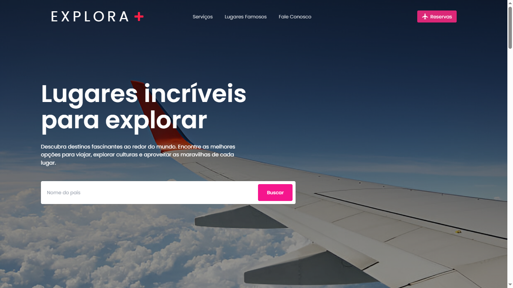

# 🌍 Explora +

## 📌 Sobre o Projeto

**Explora +** é um site de agência de turismo criado para incentivar as pessoas a descobrirem a diversidade cultural das cidades e estados do Brasil. Ele oferece informações sobre destinos turísticos, pacotes de viagem e dicas para tornar cada experiência mais imersiva e autêntica. O design é intuitivo e moderno, garantindo uma navegação fluida.

Este projeto foi desenvolvido como parte da disciplina **Linguagem de Marcação** do curso **Sistemas para Internet (P1)** no **IFPB**, em colaboração entre:  
👨‍💻 [Emanoel](https://github.com/maneuu)  
👨‍💻 [Igor](https://github.com/Igor-AI-Coder)

## 🎨 Preview do Site

<!-- Substitua "caminho/para/sua/imagem.png" pelo caminho ou URL da imagem de preview do site -->

## 🚀 Tecnologias Utilizadas

- **HTML5**
- **CSS3**
